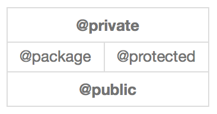

##理解封装
 

**封装**（Encapsulation）是面向对象的三大特征之一（另外两个是继承和多态），它指的是讲对象的状态信息隐藏在对象内部，不允许外部程序直接访问对象内部信息，而是通过该类所提供的方法来实现对内部信息的操作和访问。

因此一个类或对象实现良好的封装，有以下几个目的：

1. 隐藏类实现的细节

- 让使用者只能通过实现预定的方法来访问数据，从而可以在该方法里加入控制逻辑，限制对成员变量的不合理访问。

- 可进行数据检查，从而有利于保证对象信息的完整性。

- 便于修改，提高代码的可维护性。

然而为了实现良好的封装，则需要从以下两个方面进行考虑：

1. 将对象的成员变量和实现细节都隐藏起来，不允许外部直接访问。

- 把方法暴露出来，让方法来控制对这些成员变量进行安全的访问和操作。

####使用访问控制符

为了封装的良好目的性，Objective-C提供访问控制符来实现：

- @private

- @packsge

- @protected

- @public

然而其访问控制级别由小到大（由上到下）如下图所示：

关于四个访问控制级别的详细介绍如下：

- @private(当前类访问权限)：如果类的成员变量使用@private访问控制符来限制，则这个成员只能在当前类的内部被访问。这个访问控制符用于彻底隐藏成员变量。在类的实现部分定义的成员变量相当于默认使用这种访问权限。

- @package(与映像访问权限相同)：如果类的成员变量使用其来访问控制限制，则这个成员可以在当前类以及当前类实现的同一个映像的任意地方访问。很显然这个访问控制符用于部分隐藏成员变量。

- @protected(子类访问权限):这个成员可以在当前类或者当前类的子类的任意地方进行访问。一般这个访问控制符用于部分暴露成员变量。在类的接口部分定义的成员变量默认使用这种访问权限。

- @public(公共访问权限):这是一个最宽松的访问控制级别，这个成员变量可以在任意地方访问。

